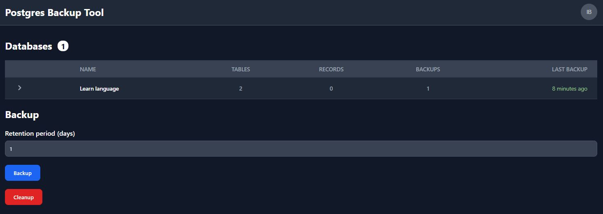
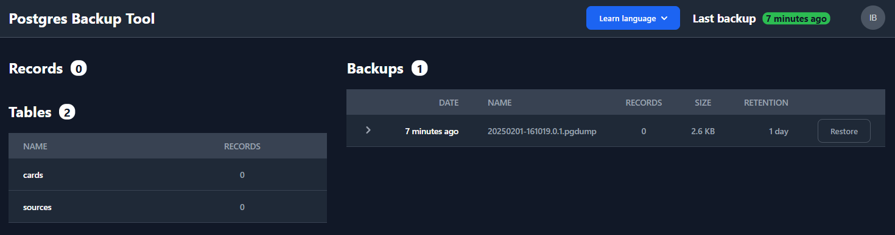

# postgres-azure-backup

Simple PostgreSQL backup tool to Azure with UI




## Features

- Supports multiple databases
- List tables and records of actual database
- Show last backup time
- Creates backups with retention period
- Based on `pg_dump` and `pg_restore` official PostgreSQL utilities
- Persists dumps in Azure Blob Storage
- Cleanup expired backups
- Restore backups
- Exclude tables from backup
- Can be used without UI as REST API. For example using a cronjob and curl
- Fully covered with E2E Selenium tests
- Compatible with PostgreSQL 16
- Secured with Microsoft Entra ID
- Azure cloud-native application

## Stack

- Java 21
- Spring Boot 3
- Angular
- Microsoft Authentication Library (MSAL)
- Azure
- PostgreSQL 16 client

## Required environment variables

- `AZURE_CLIENT_ID`
- `AZURE_TENANT_ID`
- `SPRING_ACTUATOR_PORT`
- `STORAGE_ACCOUNT_BLOB_URL`
- `STORAGE_ACCOUNT_CONTAINER_NAME`
- `DATABASES_CONFIG_PATH`
- `UI_CLIENT_ID`

## Database config file

```json
[
  {
    "name": "db1",
    "host": "db1",
    "port": 5432,
    "database": "test",
    "schema": "test1",
    "username": "postgres",
    "password": "postgres",
    "excludeTables": ["passwords", "secrets"],
    "dumpFormat": "custom",
    "createPlainDump": true
  },
  {
    "name": "db2",
    "host": "db2",
    "port": 5432,
    "database": "test",
    "schema": "test2",
    "username": "postgres",
    "password": "postgres",
    "excludeTables": ["passwords", "secrets"],
    "dumpFormat": "tar"
  }
]
```

## Dump formats

- `custom` (default) - Output a custom-format archive suitable for input into pg_restore. Together with the directory output format, this is the most flexible output format in that it allows manual selection and reordering of archived items during restore. This format is also compressed by default.
- `directory` - Output a directory-format archive suitable for input into pg_restore. This will create a directory with one file for each table and large object being dumped, plus a so-called Table of Contents file describing the dumped objects in a machine-readable format that pg_restore can read. A directory format archive can be manipulated with standard Unix tools; for example, files in an uncompressed archive can be compressed with the gzip, lz4, or zstd tools. This format is compressed by default using gzip and also supports parallel dumps.
- `tar` - Output a tar-format archive suitable for input into pg_restore. The tar format is compatible with the directory format: extracting a tar-format archive produces a valid directory-format archive. However, the tar format does not support compression. Also, when using tar format the relative order of table data items cannot be changed during restore.

## Deployment with Helm

```bash
host=$(...)
storageAccountBlobUrl=$(...)
apiClientId=$(...)
spaClientId=$(...)

helm repo add mucsi96 https://mucsi96.github.io/k8s-helm-charts
helm install mucsi96/spring-app \
    --namespace backup \
    --set image=mucsi96/postgres-azure-backup:latest \
    --set host=backup.$host \
    --set clientId=$apiClientId \
    --set serviceAccountName=postgres-azure-backup \
    --set env.STORAGE_ACCOUNT_BLOB_URL=$storageAccountBlobUrl \
    --set env.STORAGE_ACCOUNT_CONTAINER_NAME=backups \
    --set env.DATABASES_CONFIG_PATH=/app/databases_config.json \
    --set env.UI_CLIENT_ID=$spaClientId \
    --set configFile[0].name=databases_config.json \
    --set configFile[0].mountPath=/app/databases_config.json \
    --set "configFile[0].data=$(cat scripts/databases_config.json | base64)" \
    --wait
```
